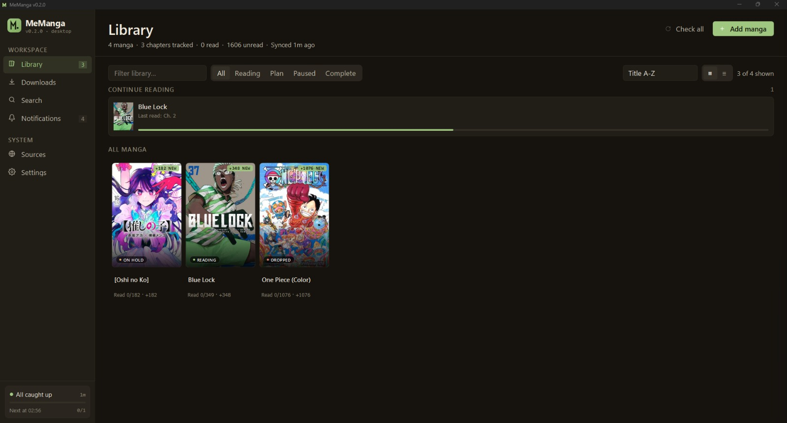
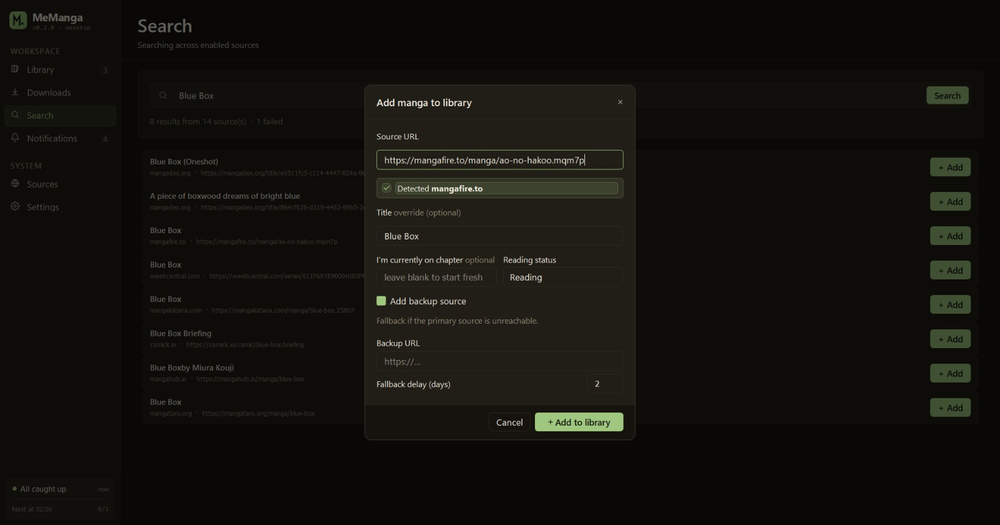
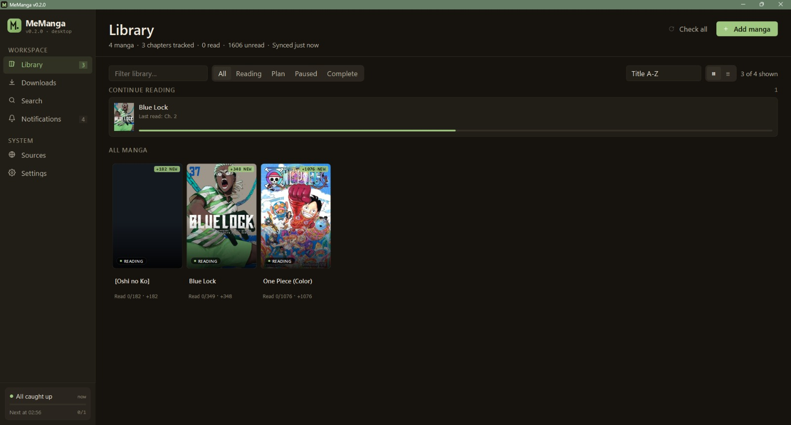
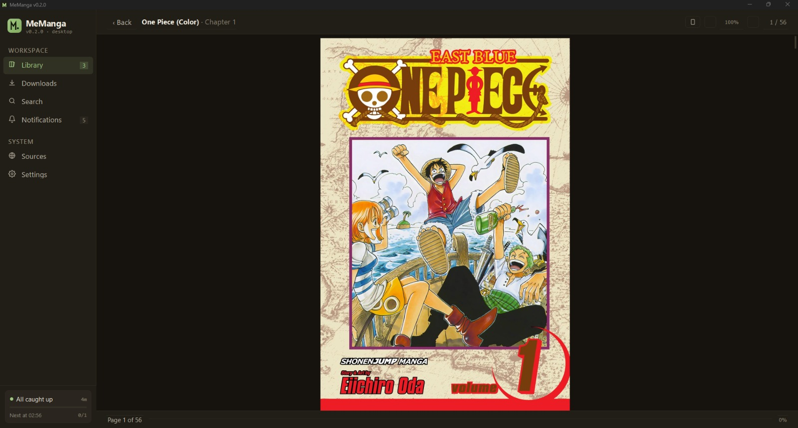
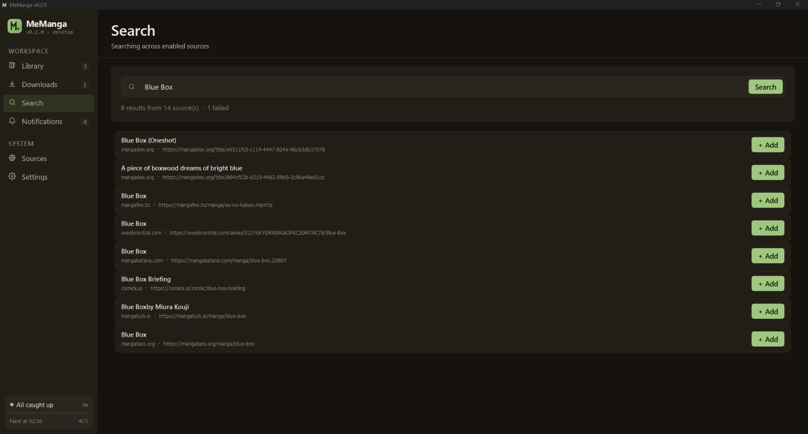
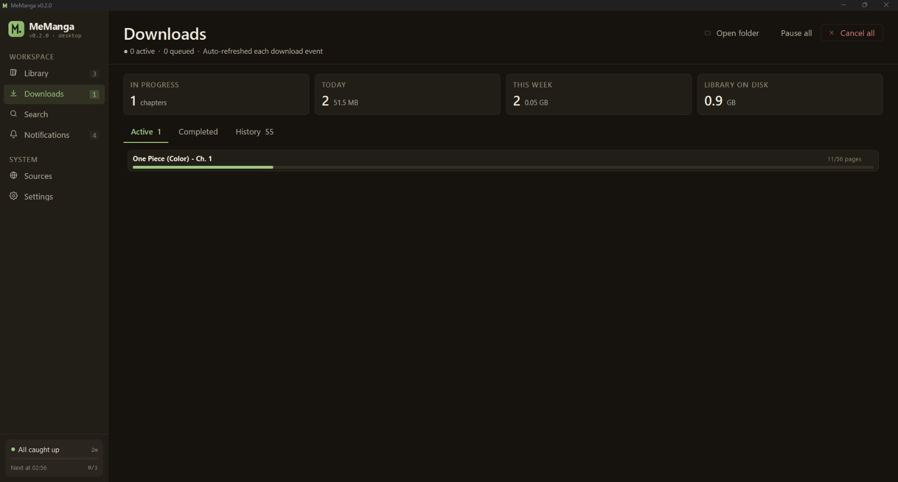
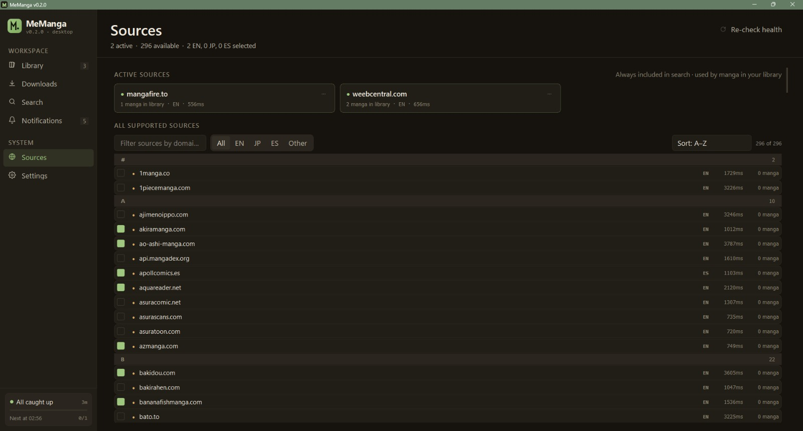
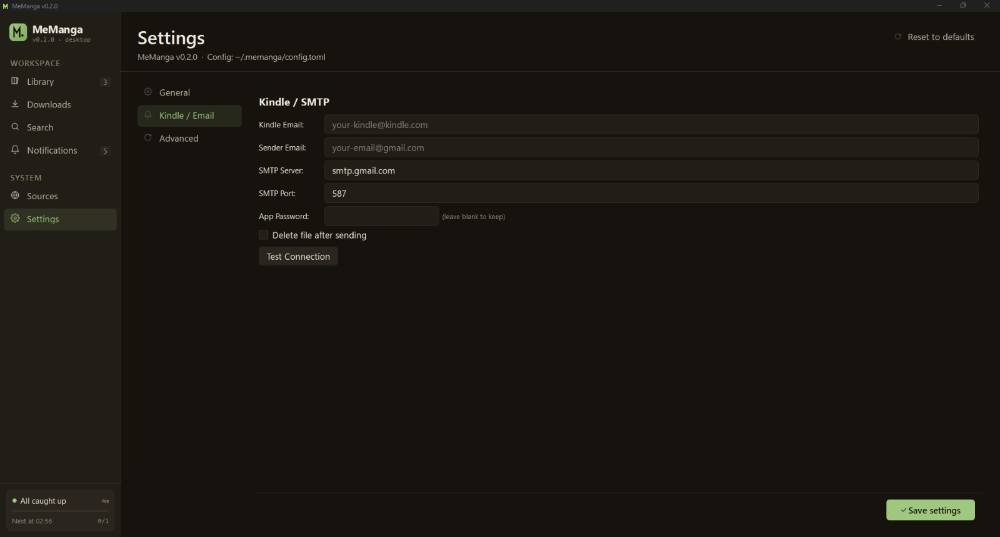

# MeManga

**Automatic manga downloader with a desktop app and a power-user CLI.**

Track manga across 227 scrapers / 322 domains, read downloaded chapters
in the built-in reader, and optionally email them to your Kindle.
Works offline once chapters are downloaded.

<p align="center">
  
</p>

<p align="center">
  <a href="https://github.com/meellm/MeManga/releases"></a>
  <a href="LICENSE"></a>
  
  
</p>

---

##  Highlights

- **Single-file desktop app** — `MeManga.exe` / `MeManga`
- **Library tracking** — your read/unread state survives reboots
- **Multi-source search** — 15 popular aggregators pre-checked, ranked by reliability
- **Built-in reader** — zoom, fit-to-page, keyboard nav, no external viewer needed
- **PDF / EPUB / CBZ / ZIP / JPG / PNG / WEBP** output
- **E-Reader delivery** — auto-send chapters by email after download
- **Backup sources** — fall back to a second source if the primary stops updating
- **Offline-aware** — gracefully disables network actions, auto-resumes when wifi returns
- **Power-user CLI** — same engine, scriptable, cron-friendly, works on headless servers
- **No telemetry, no accounts, no cloud** — everything stays on your machine

---

## Download

The fastest path is the release binary. Just double-click and you're in.

| OS | File |
|---|---|
| Windows | [`MeManga-windows-x64.exe`](https://github.com/meellm/MeManga/releases/latest) |
| macOS (Apple Silicon) | [`MeManga-macos-arm64`](https://github.com/meellm/MeManga/releases/latest) |
| Linux (x86_64) | [`MeManga-linux-x64`](https://github.com/meellm/MeManga/releases/latest) |

> **First launch downloads Firefox** (~80 MB download, one-time.)
> Playwright uses it under the hood to scrape JS-heavy sources like MangaFire and WeebCentral.
>
> **Windows SmartScreen** may warn the first time. You are not being hacked... Click "More info → Run anyway".
> The app is not yet code-signed.
>
> **macOS Gatekeeper** — right-click → Open the first time; future launches are normal.

You can also build from the source following [Build from source](#-build-from-source) below.

---

# Part 1 — Desktop App

## First five minutes

When you open MeManga for the first time:

1. The Library page is empty — click **+ Add manga** in the header.
2. Paste a manga URL from any [supported source](docs/SUPPORTED_SOURCES.md), or click **Search** in the sidebar and type the title.
3. The app remembers what you added, what you've downloaded, and what you've read across restarts and across machines
   (config lives in `~/.config/memanga/`, you can import/export it).

<p align="center">
  
</p>

## Library

The Library page is the home screen. Cards show the cover, status pill
(`READING`, `COMPLETED`, …), an unread badge when there are new
chapters, and an in-progress bar for the current chapter you're on.

<p align="center">
  
</p>

- Click a card → **Detail** page (chapter list, status, mode, Kindle toggle)
- Right-click → quick actions (mark as read, change status, remove)
- Top-right chip row filters by status; the chip count updates live

## Reader

Click any downloaded chapter on the Detail page to open it in the built-in reader.

<p align="center">
  
</p>

| Key / mouse | Action |
|---|---|
| `↑ ↓` / scroll wheel | Scroll within page |
| `← →` / `Page Up Page Down` | Previous / next chapter |
| `Ctrl/Cmd + scroll` | Zoom in/out |
| `Ctrl/Cmd + 0` | Reset zoom |
| Click-drag while zoomed | Pan |
| `Esc` | Back to Detail |

## Search

Search hits **only the 15 most popular working aggregators by default** —
MangaDex, MangaPill, MangaFire, MangaBuddy, WeebCentral, MangaKatana,
Comick, MangaHub, MangaHere, MangaPanda, MangaClash, MangaHere.onl,
MangaTaro, LuminousScans, TCBScans. You can always flip more on in the 
**Sources** tab if you want a wider net (the long-tail aggregators are
usually slower or have stale catalogs).

<p align="center">
  
</p>

Each result row shows the source domain, a `47 ch` chip telling you
how many chapters that source has, and a `+ Add` button that drops it
straight into your library. You should decide which source to use considering
the chapter number printed there.

## Downloads

The Downloads page shows what's currently downloading and what just
finished. Each row has progress, cancel, and "open folder" buttons.
Cancel-all drains the queue cleanly.

<p align="center">
  
</p>

If a chapter fails partway through, MeManga retries the failed pages
up to 3× with exponential back-off. If pages are still missing, the
chapter is **not** marked as downloaded — next "Check" will pick it
back up.

## Sources

The Sources page shows every supported domain with its current health
status (latency, last successful check, last error). Toggle individual
sources on/off; your selection persists across restarts. Websites might
be dead and still show up in there though. Jus a little **warning**.

<p align="center">
  
</p>

Hit **Re-check health** to ping every enabled source and see their status.

## Settings

- **General** — output format (PDF/EPUB/CBZ/…), download folder, theme, concurrency
- **Kindle / Email** — Gmail App Password setup for sending chapters to your Kindle
- **Advanced** — fallback-source delay, cron, cache management

<p align="center">
  
</p>

### Setting up Kindle delivery

1. [Generate a Gmail App Password](https://support.google.com/accounts/answer/185833)
   (regular passwords won't work).
2. Add your Gmail address to your 
   [Amazon "Approved Personal Document E-mail List"](https://www.amazon.com/hz/mycd/myx#/home/settings/payment).
3. In **Settings → Kindle / Email**, paste your Kindle email, sender Gmail,
   and the App Password. Hit "Test" — you'll get a "Test email sent" toast
   when it works.
4. On the Detail page of any manga, toggle **Send to Kindle after download**.

PDFs over 18 MB are split automatically; EPUB / CBZ files can't be split so they fail-loud with a size warning.

---

# Part 2 — Command-line interface

> **Just the light-weight CLI** A dedicated [`cli` branch](https://github.com/meellm/MeManga/tree/cli)
> strips PySide6 and the GUI module out of the tree,
> faster `pip install`, no Qt runtime to worry about, ideal for
> headless servers and Docker images. `main` keeps both.

The CLI ships in the source tree (not the release binary). It's the
right tool and what I use for cron jobs, headless servers, batch operations, 
and scripting. The desktop app and the CLI share the same config, state,
and download files — you can drive your library from both interchangeably.

## Install

```bash
git clone https://github.com/meellm/MeManga.git
cd MeManga
python setup.py            # creates a venv + installs everything
```

The CLI lives at `python -m memanga` once the venv is active.
On Windows, prefer:

```cmd
.\scripts\windows\setup.bat
.\scripts\windows\run.bat <command>
```

On macOS / Linux:

```bash
./scripts/run.sh <command>
```

## Commands

| Command | Purpose |
|---|---|
| `list` (`ls`) | Show every tracked manga with status + chapter counts |
| `add` | Add a manga; supports `-t TITLE -u URL [-b BACKUP_URL]` or `-i` interactive |
| `set TITLE STATUS` | `reading` / `on-hold` / `dropped` / `completed` |
| `remove TITLE` (`rm`) | Drop a manga from tracking |
| `update TITLE …` | Edit URL, backup source, or rename |
| `check [TITLE] [--from N] [--auto] [--safe]` | Look for new chapters, optionally download them |
| `failed [--retry] [--clear]` | List / re-attempt / clear partially-failed downloads |
| `status` | Show config dir, download dir, manga count, last check time |
| `config` | Interactive settings editor |
| `cron install [--time 06:00]` | Schedule a daily `check --auto` job |
| `cron status` / `cron remove` | Inspect / uninstall the cron job |
| `sources` | List all 322 supported domains, marking which ones are healthy |
| `export FILE` / `import FILE` | Back up or restore your library + state as JSON |
| `tui` | Launch the in-terminal interactive view |

Run any subcommand with `--help` for full flags.

## Common recipes

### Add a manga with a backup source

```bash
python -m memanga add \
    -t "Blue Lock" \
    -u "https://mangapill.com/manga/580/blue-lock" \
    -b "https://mangadex.org/title/4141c5dc-c525-4df5-afd7-cc7d192a832f"
```

If MangaPill stops updating, MeManga falls back to MangaDex after
`fallback_delay_days` (default 2) — long enough for a slow-translating
primary to catch up.

### Backfill an entire series from chapter 1

```bash
python -m memanga check -t "Blue Lock" --from 1 --auto --safe
```

`--safe` restarts the browser every 3 chapters to keep memory usage
flat across long bulk runs.

### Schedule daily checks

```bash
# Linux/macOS — installs a crontab entry
python -m memanga cron install --time 06:00

# Windows — register a Task Scheduler entry (run as your user)
python -m memanga cron install --time 06:00
```

### Retry every failed chapter

```bash
python -m memanga failed --retry
```

`failed` is the safety net for the "downloaded but incomplete" class of
errors - the modern downloader refuses to mark a chapter complete if
any page failed, and tracks the failure so you can batch-retry later.

---

## Sources

The default search sweep covers these 15 verified working
aggregators (popularity order):

| Source | Type | Notes |
|---|---|---|
| mangadex.org | API | Largest fan-translation library |
| mangapill.com | Requests | Fast, no Cloudflare |
| mangafire.to | Playwright | VRF bypass + image descrambling |
| mangabuddy.com | Playwright | Popular aggregator |
| weebcentral.com | Playwright | 1000+ series |
| mangakatana.com | Playwright | General library |
| comick.io | Playwright | Clean API |
| mangahub.io | Requests | Huge library |
| mangahere.cc | Requests | Reliable mirror |
| mangapanda.onl | Requests | MangaHub network |
| mangaclash.com | Playwright | Manhwa-heavy |
| mangahere.onl | Playwright | Alternate mirror |
| mangataro.org | Requests | ComicK replacement |
| luminousscans.com | Requests | Scanlation focus |
| tcbonepiecechapters.com | Requests | Jump titles (One Piece, JJK, MHA) |

200+ more aggregators are in the registry — toggle them on in the
**Sources** tab or via `python -m memanga sources`. See the
[full domain list](docs/SUPPORTED_SOURCES.md).

---

## 🛠️ Build from source

```bash
git clone https://github.com/meellm/MeManga.git
cd MeManga
python setup.py            # one-time venv setup

# Dev build — console window stays open for tracebacks
python build.py            # → ./MeManga-Dev.exe (or ./MeManga-Dev)

# Release build — no console, identical pins as the GitHub release
python build_app.py        # → ./MeManga.exe (or ./MeManga)
```

Both scripts produce a single file at the repo root and sweep their
`build/` + `dist/` scratch dirs after. The release build pulls from
`requirements-lock.txt` (exact pins for every transitive dep).

See [CONTRIBUTING.md](CONTRIBUTING.md) for project layout, test
commands, scraper-add walkthroughs, and the lock-refresh flow.

---

## Where your data lives

| Path | What |
|---|---|
| `~/.config/memanga/config.yaml` | Library, settings, source toggles, theme |
| `~/.config/memanga/state.json` | Read/unread state, download history, source health |
| `~/.config/memanga/covers/` | Cover image cache |
| `~/.config/memanga/crash.log` | Uncaught exceptions from the windowed release exe |
| `~/Downloads/MeManga/<title>/` | Default download folder (changeable in Settings) |

Sensitive credentials (SMTP App Password) are stored in the OS keyring
(Keychain on macOS, Credential Manager on Windows, Secret Service on
Linux).

---

## FAQ

**Will my downloads work without internet?**
Yes. Once a chapter is on disk it opens in the reader instantly. The
app gracefully disables network actions (Search, Check, Download)
when it detects you're offline and re-enables them when the wifi
returns.

**Does it phone home / send analytics?**
No. The app talks only to the manga sources you enable. No telemetry,
no crash reports auto-sent. Crash dumps go to `crash.log` locally -
if you want to share one in a bug report, you can (please do so).

**Why does the first launch take a while?**
It's downloading Playwright's Firefox driver (~80 MB) so it can
scrape JS-heavy sites. One-time, behind a progress dialog. After
that, startup is ~5 seconds.

**A source I use stopped working — what now?**
- Check **Sources → Re-check health** for status. If it's red, the
  site is genuinely down or changed its HTML. File an issue with the
  **Scraper broken** template so we can investigate together.
- Use the [search-result chapter chip](#-search) to spot dead sources
  at a glance — they'll show no `N ch` chip.
- Switch your manga to a backup source (Detail page → Edit) until
  the scraper is fixed.

**Can I use this on headless devices?**
The CLI runs anywhere Python 3.10+ runs. You'd typically use 
cron + the CLI's `--auto` flag and `xvfb-run` for Playwright sources.

---

## Contributing

PRs welcome — bug fixes, new scrapers, GUI polish, all of it.
See [CONTRIBUTING.md](CONTRIBUTING.md) for the dev setup, test
commands, and PR checklist. There are issue templates for
[bugs](.github/ISSUE_TEMPLATE/bug_report.md),
[features](.github/ISSUE_TEMPLATE/feature_request.md), and
[broken scrapers](.github/ISSUE_TEMPLATE/scraper_broken.md).

For security-sensitive reports, see [SECURITY.md](SECURITY.md).

## License

MIT — see [LICENSE](LICENSE).
